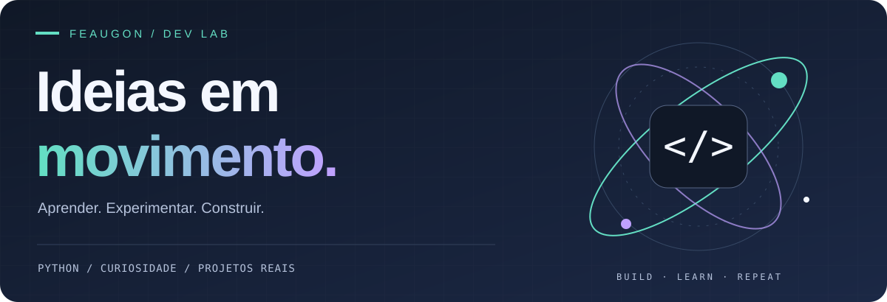
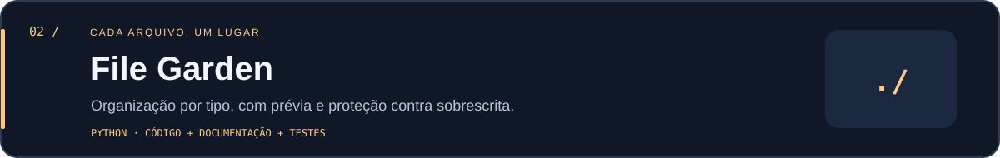

<p align="center">
  
</p>

<p align="center">
  <a href="https://github.com/Feaugon?tab=repositories"><b>Projetos</b></a> &nbsp; / &nbsp;
  <a href="https://www.linkedin.com/in/felipe-augusto-gonzaga-7929a31b9/"><b>LinkedIn</b></a> &nbsp; / &nbsp;
  <a href="#meu-laboratório"><b>Meu laboratório</b></a>
</p>

### Olá, eu sou o Felipe 👋

Curioso por novas tecnologias e pelo que dá para construir com elas. Meu caminho de aprendizado passa por **Python e Flutter**, experimentando ideias e transformando pequenos problemas em projetos.

Gosto de aprender na prática e estou aberto a trocar ideias e colaborar.

```python
def construir(ideia):
    return aprender(ideia) + experimentar(ideia) + compartilhar(ideia)
```

### Meu laboratório

Três projetos de estudo, uma ideia em comum: deixar o dia a dia mais simples. Todos usam **Python 3.10+ e a biblioteca padrão**, com código, instruções e testes próprios.

<a href="projects/focus-flow"></a>

<a href="projects/file-garden"></a>

<a href="projects/habit-bloom"></a>

| Projeto | O que você encontra | Explorar |
| :-- | :-- | :-- |
| **Focus Flow** | Timer 25/5, pausa e retomada, contador de sessões | [Código e guia](projects/focus-flow) |
| **File Garden** | Organização por extensão, prévia e nomes sem colisão | [Código e guia](projects/file-garden) |
| **Habit Bloom** | Check-in diário, sequência e histórico de 7 dias | [Código e guia](projects/habit-bloom) |

### Em construção, sempre

- 🐍 **Python:** automação, interfaces desktop e lógica de aplicações.
- 🌱 **Flutter:** parte da minha jornada de aprendizado.
- 🤝 **Colaboração:** ideias, sugestões e melhorias são bem-vindas.

<p align="center"><sub>Um projeto de cada vez. Uma ideia um pouco mais longe.</sub></p>
