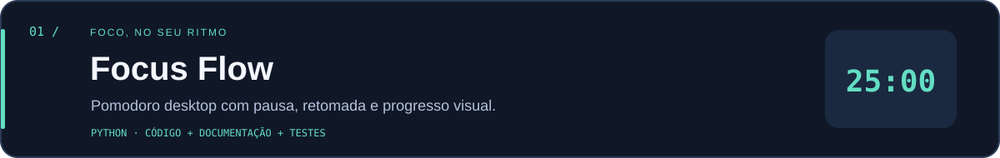

# Focus Flow



Um Pomodoro desktop para dar espaço a uma tarefa por vez. Interface escura, progresso circular e controles diretos.

## Rodar

Requer **Python 3.10+ com Tkinter**. No Windows e macOS, Tkinter costuma acompanhar a instalação oficial do Python. No Linux, pode ser necessário instalar o pacote `python3-tk` da distribuição.

Na pasta deste projeto:

```sh
python focus_flow.py
```

## Como funciona

- **Começar / Pausar:** inicia, pausa ou retoma a etapa atual. A barra de espaço também funciona.
- **Reiniciar:** volta ao início da etapa atual, preservando o contador de sessões.
- Cada sessão tem **25 minutos de foco e 5 de pausa**.
- Ao terminar uma etapa, o app emite o aviso sonoro do sistema e aguarda você iniciar a próxima.
- O relógio usa tempo monotônico para evitar acúmulo de erro entre atualizações da interface.

O contador fica em memória e recomeça ao fechar o app. Não há notificações do sistema ou configurações de duração na interface nesta versão.

## Testar

```sh
python -m unittest discover -v
```

Os testes verificam pausa e retomada, transição de etapas, reinício, início duplicado e duração inválida. A classe `Timer` é separada da interface e recebe o instante atual para permitir testes sem esperar minutos.

[← Voltar ao perfil](../../README.md)
