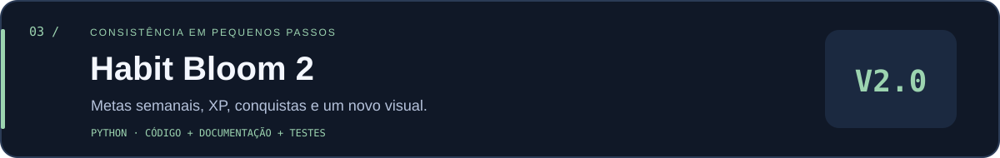

# Habit Bloom



Um app desktop para cultivar pequenas rotinas. Adicione um hábito, marque o dia e acompanhe sua sequência e os últimos sete dias.

## Rodar

Requer **Python 3.10+ com Tkinter**. No Linux, Tkinter pode precisar do pacote `python3-tk` da distribuição.

Na pasta deste projeto:

```sh
python habit_bloom.py
```

O app salva em `~/.habit-bloom/habits.json`, onde `~` é a pasta do seu usuário. Para escolher outro arquivo:

```sh
python habit_bloom.py --data "meus-dados/habits.json"
```

## Usar

1. Digite um hábito de até 60 caracteres e clique em **+ Hábito** ou pressione Enter.
2. Clique em **Marcar hoje** para registrar o dia. Clique novamente para desmarcar.
3. Veja o total de hábitos feitos hoje, a sequência de dias e o histórico da semana em cada cartão.

A sequência considera dias consecutivos até hoje. Se hoje ainda estiver pendente, ela pode terminar ontem; perder um dia completo zera a sequência atual. O aplicativo usa a data local do computador e atualiza a interface quando o dia muda.

## Dados e limites

- Os dados ficam apenas no arquivo local, em JSON legível.
- Cada salvamento escreve um arquivo temporário e só então substitui o anterior.
- Dados inválidos interrompem a abertura sem sobrescrever o arquivo existente.
- Não há conta, sincronização, edição retroativa, exclusão ou renomeação de hábitos nesta versão.
- Use uma instância por arquivo de dados; não há coordenação entre instâncias simultâneas.
- Para backup, feche o app e copie o JSON para um local de sua escolha.

## Testar

```sh
python -m unittest discover -v
```

Os testes verificam persistência, marcação e desmarcação, validação de nomes, sequência entre meses e anos bissextos, dados corrompidos e falha ao salvar.

[← Voltar ao perfil](../../README.md)
